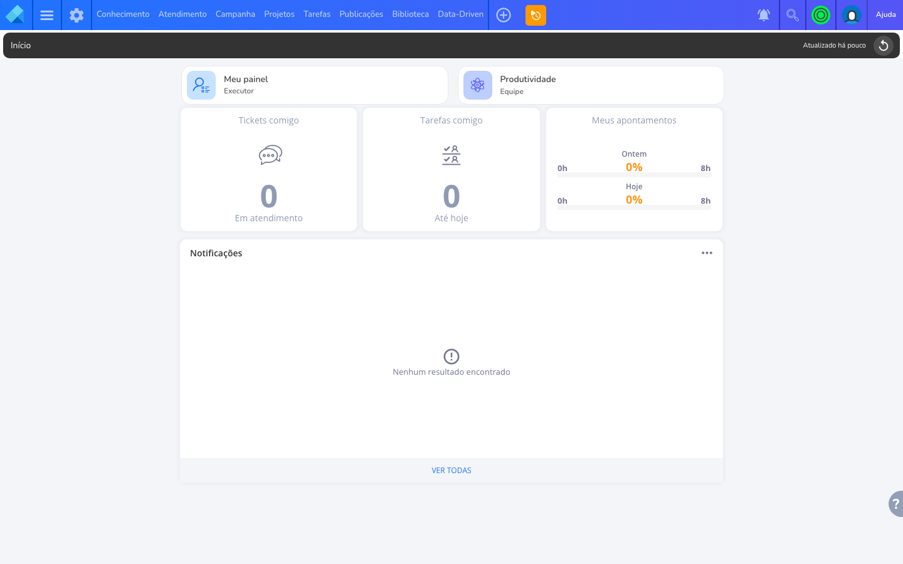
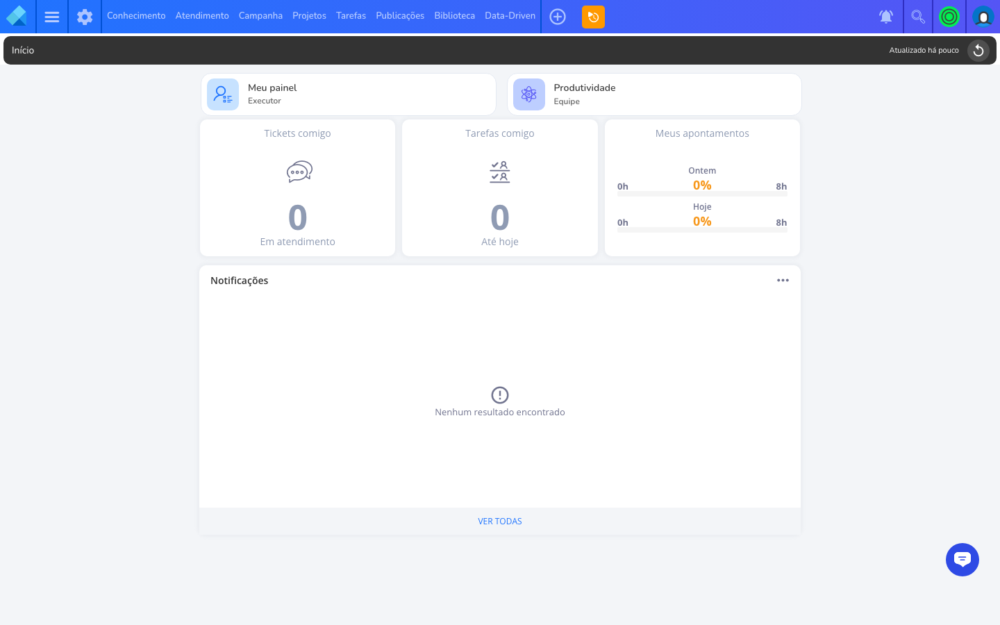
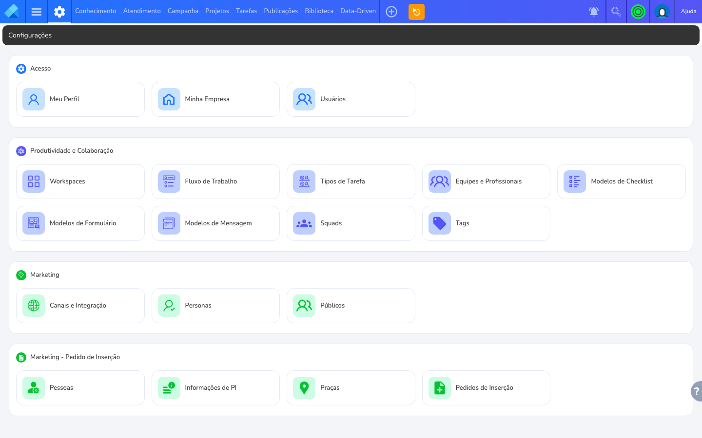
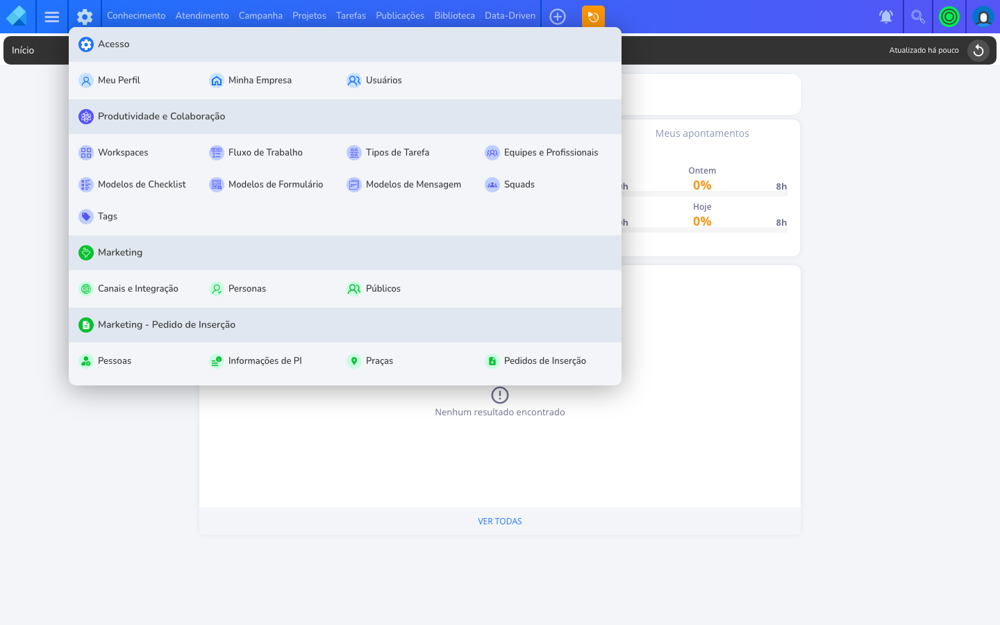
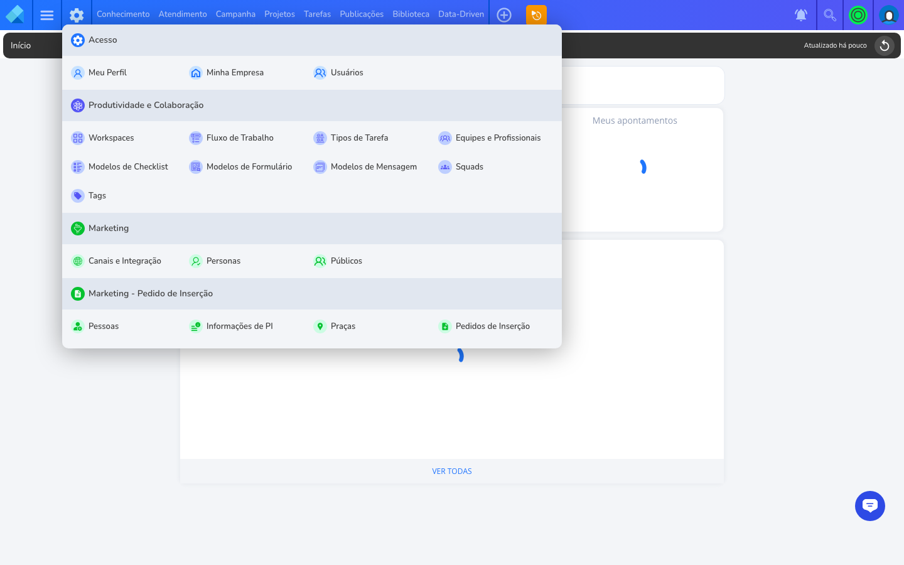
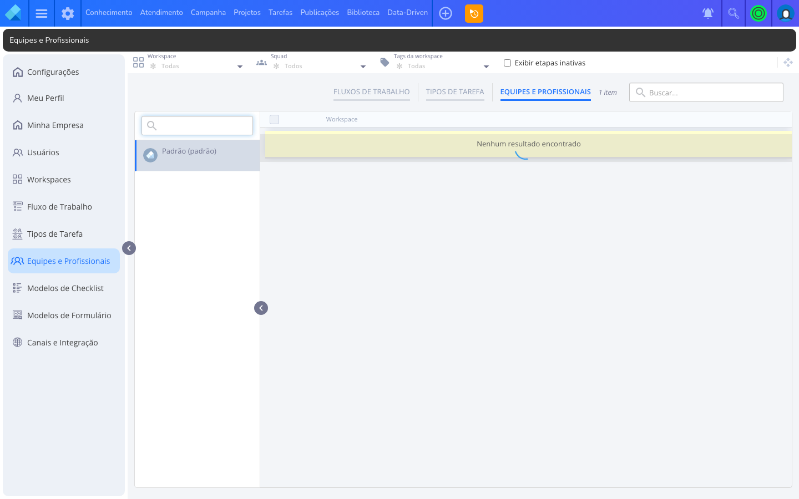
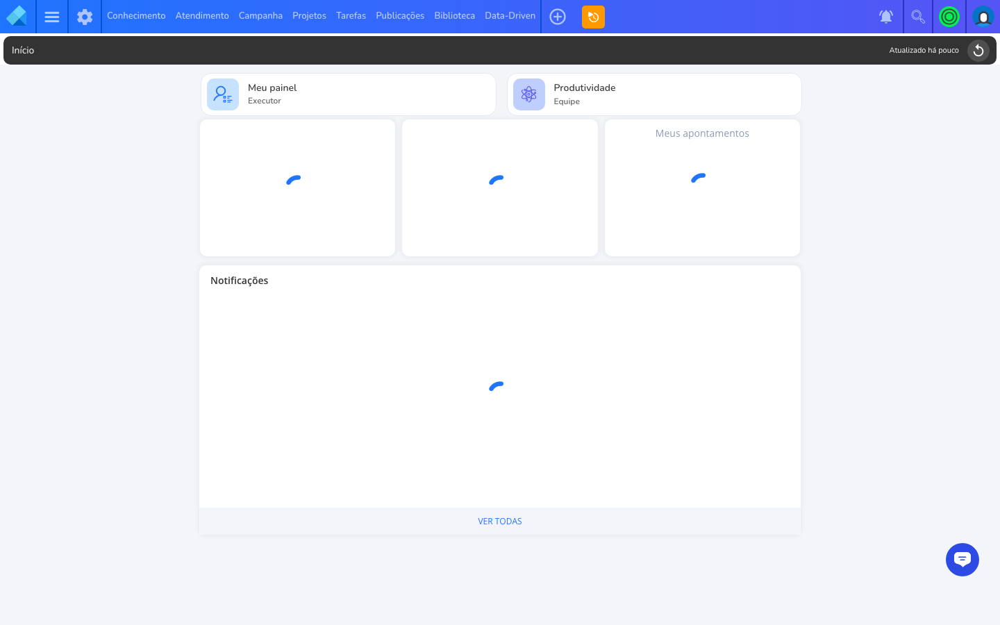
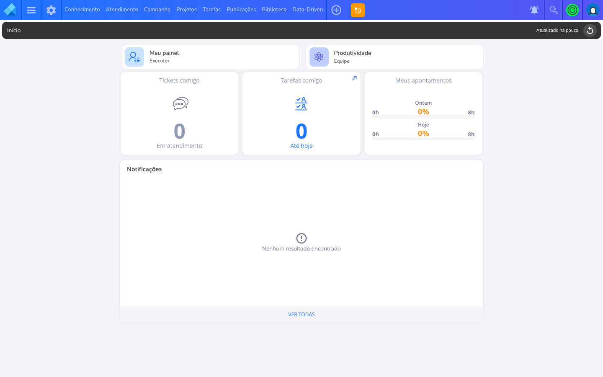
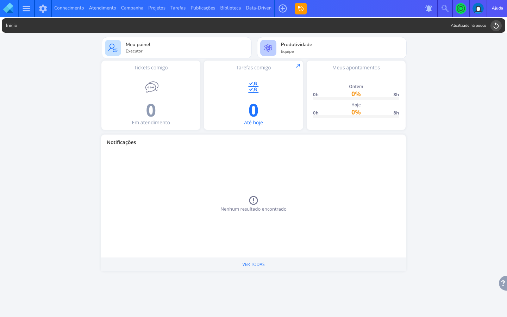
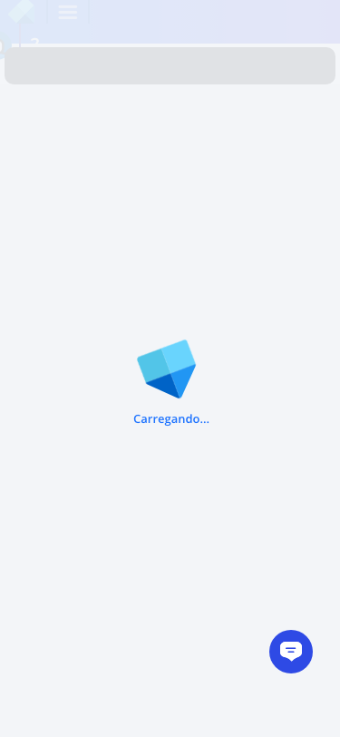

# Tour Ekyte — notas brutas

Gerado em: 2026-05-04T19:51:18.489Z
Total de capturas: 23

## 00-login — Login / sessão
Status: **ok**

Login OK em https://app.ekyte.com/#/home

## 01-dashboard — Dashboard inicial / home pós-login
Status: **ok**

URL atual: https://app.ekyte.com/#/home | título: Início | eKyte

## stack — Stack detectado
Status: **ok**

{"tailwind":false,"muiClass":false,"antd":false,"chakra":false,"shadcnRadix":false,"tiptap":false,"reactRoot":false,"framework":"spa-react-likely","title":"Início | eKyte"}

## sidebar — Sidebar / navegação principal
Status: **ok**

- keyboard_arrow_down → https://app.ekyte.com/#/settings
- Conhecimento → https://app.ekyte.com/#/boards
- Atendimento → https://app.ekyte.com/#/tickets
- Campanha → https://app.ekyte.com/#/plannings
- Projetos → https://app.ekyte.com/#/projects
- Tarefas → https://app.ekyte.com/#/tasks/list
- Publicações → https://app.ekyte.com/#/publications
- Biblioteca → https://app.ekyte.com/#/artifacts
- Data-Drivenkeyboard_arrow_down → https://app.ekyte.com/#/edd

## 03-task-create-modal — Modal de criação de tarefa
Status: **parcial**

Gatilho usado: nenhum | campos visíveis: 0

Campos detectados (top 40):

## 04-view-kanban — Visualização: kanban
Status: **ok**

Trocou via: a:has-text("Board")

## 04-view-list — Visualização: list
Status: **nao-encontrado**

Botão de visualização não encontrado nesta tela.

## 04-view-calendar — Visualização: calendar
Status: **nao-encontrado**

Botão de visualização não encontrado nesta tela.

## 04-view-gantt — Visualização: gantt
Status: **nao-encontrado**

Botão de visualização não encontrado nesta tela.

## 04-view-dashboard — Visualização: dashboard
Status: **nao-encontrado**

Botão de visualização não encontrado nesta tela.

## 05-task-detail — Detalhe da tarefa (sheet/modal)
Status: **nao-encontrado**

Não localizou tarefa para abrir.

## 06-templates — Templates de projeto/tarefa
Status: **nao-encontrado**

Não localizado por busca textual na navegação.

## 07-aprovacoes — Aprovações / fluxos
Status: **nao-encontrado**

Não localizado por busca textual na navegação.

## 08-social — Mídia social / calendário editorial
Status: **nao-encontrado**

Não localizado por busca textual na navegação.

## 09-relatorios — Relatórios / Analytics
Status: **nao-encontrado**

Não localizado por busca textual na navegação.

## 10-integracoes — Integrações
Status: **nao-encontrado**

Não localizado por busca textual na navegação.

## 11-permissoes — Permissões / membros
Status: **ok**

Encontrado via: a:has-text("Equipe") | URL: https://app.ekyte.com/#/admin/team-members

## 12-workload — Workload / capacity
Status: **nao-encontrado**

Não localizado por busca textual na navegação.

## 13-sla — SLA
Status: **nao-encontrado**

Não localizado por busca textual na navegação.

## 16-config — Configurações de conta/workspace
Status: **nao-encontrado**

Não localizado por busca textual na navegação.

## 14-comentarios — Comentários ricos (mention/anexo/reação)
Status: **parcial**

Capturou painel de comentários se aberto — não testou @mention para evitar criar ruído. Verificar manualmente no screenshot.

## 15-shortcuts — Atalhos de teclado (modal ?)
Status: **parcial**

Tentou Shift+? e ?. Validar visualmente o screenshot — se modal aparecer extrair lista para keyboard-shortcuts.md.

## 17-mobile — Mobile (375x812)
Status: **ok**

URL: https://app.ekyte.com/#/home

